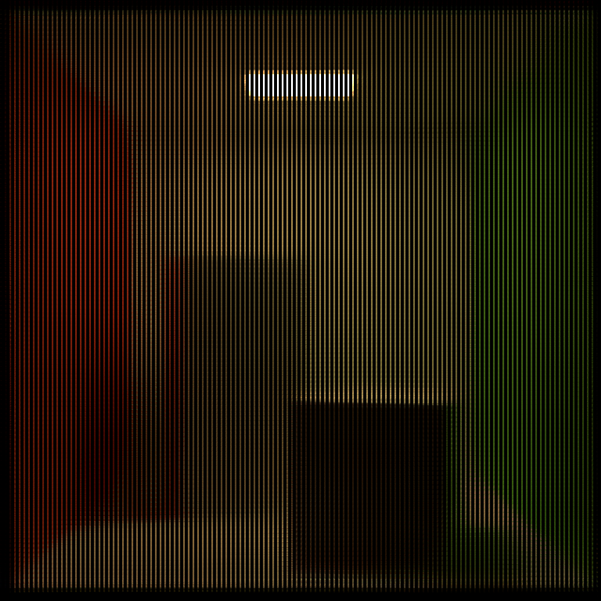

[](https://opensource.fb.com/support-ukraine)

# rules_oidn -- Bazel build rules for Intel Open Image Denoise

Rules for using [Intel Open Image Denoise](https://www.openimagedenoise.org/) in your Bazel builds.

## Current status

Currently, these rules compile on Ubuntu 22.04 and Windows.
Building on macOS is currently not working.
If you run the example (see "Quick start") the following output is generated:



## Quick start

**Prerequisites:**

The following tools should be installed:

- [Git](https://git-scm.com/)
- [Bazel](https://bazel.build/install)
- A C++ compiler (GCC, Visual Studio, Clang, etc.)

**Checkout, build, and run:**

*All platforms:*

```shell
git clone https://github.com/Vertexwahn/rules_oidn.git
cd rules_oidn
cd tests
```

*Run example with Ubuntu 22.04:*

```shell
bazel run --config=gcc11 //:example
```

*Run example with Visual Studio 2022:*

```shell
bazel run --config=vs2022 //:example
```

See [tests/.bazelrc](tests/.bazelrc) for other supported build configs.

## More about the example

The example provides a noisy rendering of the Cornell Box.


Additionally, there is a corresponding albedo image:


And a normal image:


This serves as an input for the example.

## Other projects related to this

There is a command line tool that makes use of OIDN:
https://declanrussell.com/portfolio/intel-open-image-denoiser-2/

How to run it:

```shell
.\Denoiser.exe -i .\noisy_10spp.exr -o denoised.exr -a .\albedo_10spp.exr -n .\normal_10spp.exr
```

## Generating weights manually

```shell
python3 .\scripts\blob_to_cpp.py .\weights\rt_alb.tza -o .\weights\rt_alb.tza.cpp -H .\weights\rt_alb.tza.h
python3 .\scripts\blob_to_cpp.py .\weights\rt_hdr.tza -o .\weights\rt_hdr.tza.cpp -H .\weights\rt_hdr.tza.h
python3 .\scripts\blob_to_cpp.py .\weights\rt_hdr_alb.tza -o .\weights\rt_hdr_alb.tza.cpp -H .\weights\rt_hdr_alb.tza.h
python3 .\scripts\blob_to_cpp.py .\weights\rt_hdr_alb_nrm.tza -o .\weights\rt_hdr_alb_nrm.tza.cpp -H .\weights\rt_hdr_alb_nrm.tza.h
python3 .\scripts\blob_to_cpp.py .\weights\rt_hdr_calb_cnrm.tza -o .\weightsrt_hdr_calb_cnrm.tza.cpp -H .\weights\rt_hdr_calb_cnrm.tza.h
python3 .\scripts\blob_to_cpp.py .\weights\rt_ldr.tza -o .\weights\rt_ldr.tza.cpp -H .\weights\rt_ldr.tza.h
python3 .\scripts\blob_to_cpp.py .\weights\rt_ldr_alb.tza -o .\weights\rt_ldr_alb.tza.cpp -H .\weights\rt_ldr_alb.tza.h
python3 .\scripts\blob_to_cpp.py .\weights\rt_ldr_alb_nrm.tza -o .\weights\rt_ldr_alb_nrm.tza.cpp -H .\weights\rt_ldr_alb_nrm.tza.h
python3 .\scripts\blob_to_cpp.py .\weights\rt_ldr_calb_cnrm.tza -o .\weights\rt_ldr_calb_cnrm.tza.cpp -H .\weights\rt_ldr_calb_cnrm.tza.h
python3 .\scripts\blob_to_cpp.py .\weights\rt_nrm.tza -o .\weights\rt_nrm.tza.cpp -H .\weights\rt_nrm.tza.h
python3 .\scripts\blob_to_cpp.py .\weights\rtlightmap_dir.tza -o .\weights\rtlightmap_dir.tza.cpp -H .\weights\rtlightmap_dir.tza.h
python3 .\scripts\blob_to_cpp.py .\weights\rtlightmap_hdr.tza -o .\weights\rtlightmap_hdr.tza.cpp -H .\weights\rtlightmap_hdr.tza.h
```

## License

This work is published under the Apache 2.0 License.

Notes: This repository contains code copied from [TensorFlow](https://github.com/tensorflow/tensorflow) which is also under the Apache 2.0 License.
The copyright of this work belongs to the TensorFlow authors.
