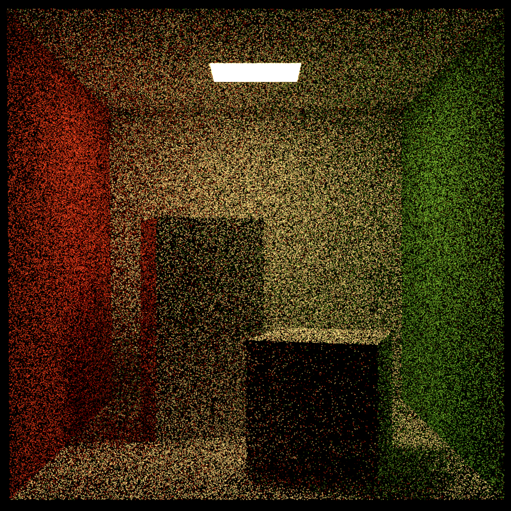
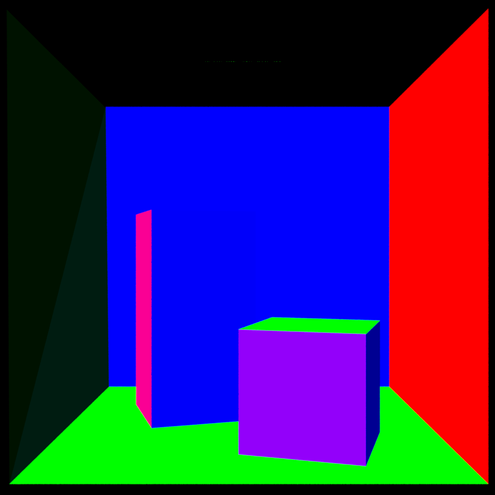

[](https://opensource.fb.com/support-ukraine)

# rules_oidn -- Bazel build rules for Intel Open Image Denoise

Rules for using [Intel Open Image Denoise](https://www.openimagedenoise.org/) in your Bazel builds.

## Current status

Currently, this rules compile only on Ubuntu 22.04. 
Windows and macOS builds fail with errors.
If you run the example (see next section) the following output is generated:

```shell
Simple denoising example
Error: unsupported combination of input features
```

This is because the build magic that converts the weight to cpp files is not in place right now.

## How to test?

```shell
git clone https://github.com/Vertexwahn/rules_oidn.git
cd rules_oidn
cd tests
bazel run --config=gcc11 //:example # See test/.bazelrc for other supported configs
```

## More about the example

The example provides noisy rendering of the Cornell Box.



Additionally there is a corrsponding albedo image:


And a normal image:



This serves as an input for the example.

## License

This work is published under the Apache 2.0 License.
