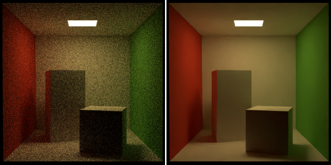

[](https://opensource.fb.com/support-ukraine)

# rules_oidn -- Bazel build rules for Intel Open Image Denoise

Rules for using [Intel Open Image Denoise](https://www.openimagedenoise.org/) in your Bazel builds.

## What it does?

Open Image Denoise can be use to denoise your images.
Given a noisy input image Open Image Denoise can produce a denoised output image:



More comparison images can be found [here](docs/denoised.pdf).

`rules_oidn` helps you to embed Open Image Denoise 1.4.3 into your Bazel builds.

## Current status

Currently, these rules compile on Ubuntu 22.04 (other Linux distributions should also work) and Windows.
Building on macOS is currently not working.

The goal of `rules_oidn` is not to reproduce a 1:1 binary compatible library that is equal to a CMake build.
The focus is on the compilation of a working library that can be used in Bazel projects and is close to the CMake build.
The following table compares the precompiled version of OIDN to this Bazel build:

| Dependency                            | Bazel                                     | [Precompiled Open Image Denoise v1.4.3](https://github.com/OpenImageDenoise/oidn/releases/tag/v1.4.3) |
|---------------------------------------|-------------------------------------------|-------------------------------------------------------------------------------------------------------|
| oneDNN                                | 2.7.3                                     | 2.2.4                                                                                                 |
| Intel® Implicit SPMD Program Compiler | v1.19.0                                   | ?                                                                                                     |
| ComputeLibrary                        | 22.11                                     | ?                                                                                                     |
| oneTBB                                | a6a884ad0a4920415c4db88ea8927e5877dbe545  | oneTBB 2021.5.0                                                                                       |

### macOS Support

Building on macOS is currently not working.
Initially, I was running here in the wrong direction.
I was thinking that the macOS version of OIDN 1.4.3 is also using oneDNN.
Therefore, I tried to fix this code path.
E.g. fixing ComputeLibrary OpenMP issues with the use of Apple Clang,
come up with a macOS build OneDNN, 
or try to fix `isISASupported(ISA::AVX512_CORE)` issue in OIDN.
Finally, I found out that ODIN 1.4.3 uses on macOS BNNS as a neural runtime.
Something that I could have figured out quite earlier, 
but anyway finally I found it out.
My hope is that the BNNS path can be bazelized straight forward.

## Quick start

**Prerequisites:**

The following tools should be installed:

- [Git](https://git-scm.com/)
- [Bazel](https://bazel.build/install)
- A C++ compiler (GCC, Visual Studio, Clang, etc.)

**Checkout, build, and run:**

*All platforms:*

```shell
git clone https://github.com/Vertexwahn/rules_oidn.git
cd rules_oidn
cd tests
```

*Run example with Ubuntu 22.04:*

```shell
bazel run --config=gcc11 //:example
```

*Run example with Visual Studio 2022:*

```shell
bazel run --config=vs2022 //:example
```

*Run example with macOS:*

```shell
bazel run --config=macos //:example
```

See [tests/.bazelrc](tests/.bazelrc) for other supported build configs.

You can also provide the filenames of the input and output image as an argument, e.g. on Ubuntu 22.04:

```shell
bazel run --config=gcc11 //:example -- --input=${HOME}/rules_oidn/tests/data/cornell_box.naive_diffuse.box_filter.spp64.embree.exr --output=${HOME}/denoised_spp64.exr
```

## More about the example

The example provides a noisy rendering of the Cornell Box.


Additionally, there is a corresponding albedo image:


And a normal image:


Currently, only the noisy rendering serves as an input for the example. 
The albedo and normal images are not used.
But you can easily modify the example code to use them.

## Other projects related to this

There is a command line tool that makes use of OIDN:
https://declanrussell.com/portfolio/intel-open-image-denoiser-2/

How to run it:

```shell
.\Denoiser.exe -i .\noisy_10spp.exr -o denoised.exr -a .\albedo_10spp.exr -n .\normal_10spp.exr
```

## Generating weights manually

```shell
python3 .\scripts\blob_to_cpp.py .\weights\rt_alb.tza -o .\weights\rt_alb.tza.cpp -H .\weights\rt_alb.tza.h
python3 .\scripts\blob_to_cpp.py .\weights\rt_hdr.tza -o .\weights\rt_hdr.tza.cpp -H .\weights\rt_hdr.tza.h
python3 .\scripts\blob_to_cpp.py .\weights\rt_hdr_alb.tza -o .\weights\rt_hdr_alb.tza.cpp -H .\weights\rt_hdr_alb.tza.h
python3 .\scripts\blob_to_cpp.py .\weights\rt_hdr_alb_nrm.tza -o .\weights\rt_hdr_alb_nrm.tza.cpp -H .\weights\rt_hdr_alb_nrm.tza.h
python3 .\scripts\blob_to_cpp.py .\weights\rt_hdr_calb_cnrm.tza -o .\weightsrt_hdr_calb_cnrm.tza.cpp -H .\weights\rt_hdr_calb_cnrm.tza.h
python3 .\scripts\blob_to_cpp.py .\weights\rt_ldr.tza -o .\weights\rt_ldr.tza.cpp -H .\weights\rt_ldr.tza.h
python3 .\scripts\blob_to_cpp.py .\weights\rt_ldr_alb.tza -o .\weights\rt_ldr_alb.tza.cpp -H .\weights\rt_ldr_alb.tza.h
python3 .\scripts\blob_to_cpp.py .\weights\rt_ldr_alb_nrm.tza -o .\weights\rt_ldr_alb_nrm.tza.cpp -H .\weights\rt_ldr_alb_nrm.tza.h
python3 .\scripts\blob_to_cpp.py .\weights\rt_ldr_calb_cnrm.tza -o .\weights\rt_ldr_calb_cnrm.tza.cpp -H .\weights\rt_ldr_calb_cnrm.tza.h
python3 .\scripts\blob_to_cpp.py .\weights\rt_nrm.tza -o .\weights\rt_nrm.tza.cpp -H .\weights\rt_nrm.tza.h
python3 .\scripts\blob_to_cpp.py .\weights\rtlightmap_dir.tza -o .\weights\rtlightmap_dir.tza.cpp -H .\weights\rtlightmap_dir.tza.h
python3 .\scripts\blob_to_cpp.py .\weights\rtlightmap_hdr.tza -o .\weights\rtlightmap_hdr.tza.cpp -H .\weights\rtlightmap_hdr.tza.h
```

## Reading material

- [DNND 1: a Deep Neural Network Dive](https://maxliani.wordpress.com/2023/03/17/dnnd-1-a-deep-neural-network-dive/)

## License

This work is published under the Apache 2.0 License.

### Notes on copyright

This repository contains code copied from [TensorFlow](https://github.com/tensorflow/tensorflow) which is also under the Apache 2.0 License.
The copyright of the corresponding files belongs to the TensorFlow authors.
